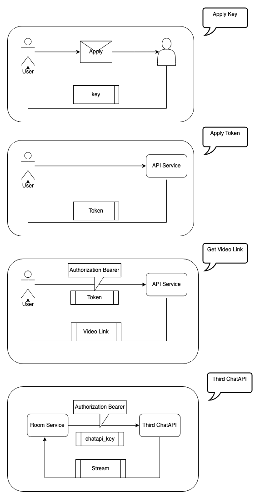
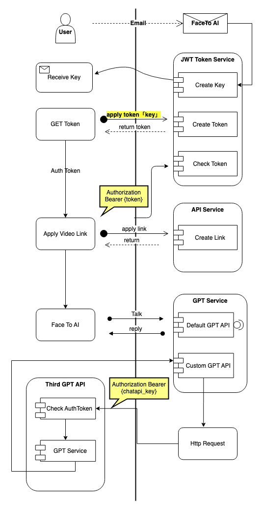

# Our Thoughts
- If you need to use our FaceTo-AI tool, you need to apply by email, our email address: zhangxiubo@elihr.cn
- All interface calls need to validate the Authorization.
- We only provide a uniform encryption algorithm, which can only be used by callers if they meet our encryption rules.

# Noun Interpretation

* `Key `

> 1. You need to apply to us by email.
> 2. You can exchange tokens for keys.
> 3. Example：APIfutm3SazWAe6

* `Token`

> 1. You need to send your key through our email in exchange for the specific value.
> 2. Each token has a specific range of functional permissions, eg.`GetLink` `CanGetVideoMessage` `CanGetVideoLink`
> 3. Each token has an expiration time, which is 24 hours by default.

* `Chatapi_key`

> 1. The auth key required by chatapi.[Get FaceTo-AI Room Link](api-85139473)
> 2. If it is set, we will put it in the Authorization Bearer in the http header when calling chatapi. like as `Authorization Bearer {key}`.

# Flow Chart

## 1. Key、Token、AesToken Flow Chart

## 2. Overall Flow Chart

